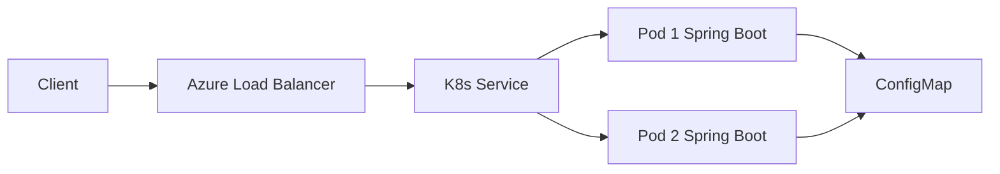

# Azure Kubernetes Service (AKS) — Spring Boot Demo

A minimal Java 21 + Spring Boot 3 application packaged for Docker and deployed to **Azure Kubernetes Service (AKS)**.

## What’s included

| Component | Purpose |
|-----------|---------|
| Spring Boot REST API | `/api/hello`, `/api/info` |
| Spring Actuator | Liveness/readiness probes for Kubernetes |
| Dockerfile | Multi-stage build (Maven + JRE) |
| `k8s/` manifests | Namespace, ConfigMap, Deployment (2 replicas), LoadBalancer Service |
| Scripts | Local deploy, Azure resource setup, ACR push |

## Prerequisites

- Java 21, Maven 3.9+
- Docker
- [kubectl](https://kubernetes.io/docs/tasks/tools/)
- For Azure: [Azure CLI](https://learn.microsoft.com/cli/azure/install-azure-cli) (`az login`)

Local Kubernetes (optional): [minikube](https://minikube.sigs.k8s.io/) or [Docker Desktop Kubernetes](https://docs.docker.com/desktop/kubernetes/).

## Run locally (no Kubernetes)

```bash
mvn spring-boot:run
curl http://localhost:8080/api/hello
curl http://localhost:8080/actuator/health
```

## Run tests

```bash
mvn test
```

## Deploy to local Kubernetes

```bash
chmod +x scripts/*.sh
./scripts/deploy-local.sh
kubectl get svc aks-spring-demo -n aks-demo -w
# When EXTERNAL-IP is assigned:
curl http://<EXTERNAL-IP>/api/hello
```

## Deploy to Azure (AKS)

### 1. Create Azure resources

```bash
chmod +x scripts/*.sh
./scripts/azure-setup.sh
```

Note the ACR name printed at the end.

### 2. Build and push image to Azure Container Registry

```bash
./scripts/push-to-acr.sh <your-acr-name> 1.0.0
```

### 3. Point manifests at your registry

Edit `k8s/overlays/azure/kustomization.yaml` and replace `YOUR_ACR_NAME` with your ACR name.

### 4. Deploy to AKS

```bash
kubectl apply -k k8s/overlays/azure
kubectl get pods -n aks-demo
kubectl get svc aks-spring-demo -n aks-demo
```

Azure provisions a **public LoadBalancer** IP. Test:

```bash
curl http://<EXTERNAL-IP>/api/hello
curl http://<EXTERNAL-IP>/api/info
```

## Architecture



## API endpoints

| Method | Path | Description |
|--------|------|-------------|
| GET | `/api/hello` | Greeting + pod hostname + timestamp |
| GET | `/api/info` | App metadata |
| GET | `/actuator/health` | Health (used by probes) |

## Configuration

- `APP_MESSAGE` — greeting text (from ConfigMap in cluster)
- `application.yml` — server port, actuator probe settings

## Clean up Azure resources

```bash
az group delete --name aks-demo-rg --yes --no-wait
```

Adjust the resource group name if you changed `RESOURCE_GROUP` in `azure-setup.sh`.

## Project structure

```
├── pom.xml
├── Dockerfile
├── src/main/java/com/demo/aks/
├── k8s/
│   ├── base/
│   │   ├── deployment.yaml
│   │   ├── service.yaml
│   │   └── ...
│   └── overlays/
│       ├── local/    # Docker Desktop / minikube
│       └── azure/
└── scripts/
    ├── deploy-local.sh
    ├── azure-setup.sh
    └── push-to-acr.sh
```
