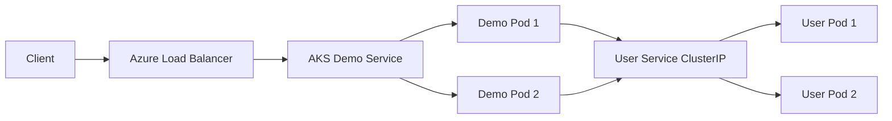
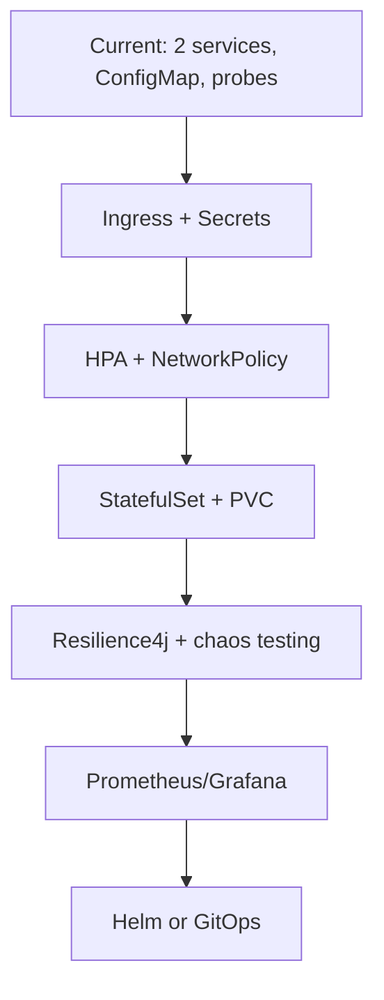

# Azure Kubernetes Service (AKS) — Spring Boot Demo

A minimal Java 21 + Spring Boot 3 application packaged for Docker and deployed to **Azure Kubernetes Service (AKS)**.

## What’s included

| Component | Purpose |
|-----------|---------|
| Spring Boot REST API | `/api/hello`, `/api/info`, `/api/demo/users` |
| Spring Actuator | Liveness/readiness probes for Kubernetes |
| Dockerfile | Multi-stage build (Maven + JRE) |
| `k8s/` manifests | Namespace, ConfigMap, Deployment (2 replicas), LoadBalancer Service |
| Scripts | Local deploy, Azure resource setup, ACR push |

## Prerequisites

- Java 21, Maven 3.9+
- Docker
- [kubectl](https://kubernetes.io/docs/tasks/tools/)
- For Azure: [Azure CLI](https://learn.microsoft.com/cli/azure/install-azure-cli) (`az login`)

Local Kubernetes (optional): [minikube](https://minikube.sigs.k8s.io/) or [Docker Desktop Kubernetes](https://docs.docker.com/desktop/kubernetes/).

## Run locally (no Kubernetes)

Start the user service first (in `../Azure_User_Service`):

```bash
cd ../Azure_User_Service && mvn spring-boot:run
```

Then run this demo app:

```bash
mvn spring-boot:run
curl http://localhost:8080/api/hello
curl http://localhost:8080/api/demo/users
curl http://localhost:8080/actuator/health
```

## Run tests

```bash
mvn test
```

## Deploy to local Kubernetes

Deploy the user service first:

```bash
cd ../Azure_User_Service
chmod +x scripts/*.sh
./scripts/deploy-local.sh
```

Then deploy this demo app:

```bash
cd ../Azure_Kubernetes_Service
chmod +x scripts/*.sh
./scripts/deploy-local.sh
kubectl get svc aks-spring-demo -n aks-demo -w
# When EXTERNAL-IP is assigned:
curl http://<EXTERNAL-IP>/api/hello
curl http://<EXTERNAL-IP>/api/demo/users
```

## Deploy to Azure (AKS)

Shared Azure settings (same cluster for both services):

| Setting | Value |
|---------|-------|
| Resource group | `aks-demo-rg` |
| AKS cluster | `aks-demo-cluster` |
| ACR | `aksdemodemo776b77.azurecr.io` |
| Demo namespace | `aks-demo` |
| User namespace | `user-demo` |
| Internal user URL | `http://azure-user-service.user-demo.svc.cluster.local` |

### 1. Create Azure resources (first time only)

```bash
chmod +x scripts/*.sh
./scripts/azure-setup.sh
```

Defaults: **1 node**, **`Standard_D2s_v3`** (2 vCPUs) — fits typical free-account regional quota (~4 vCPUs in `eastus`).

If you hit `InsufficientVCPUQuota`, avoid large SKUs (e.g. `standard_dc16ads_cc_v5` = 16 vCPUs). Override:

```bash
NODE_COUNT=1 NODE_VM_SIZE=Standard_D2s_v3 ./scripts/azure-setup.sh
```

Check quota: `az vm list-usage --location eastus -o table`

### 2. Deploy User Service on the same AKS cluster

```bash
cd ../Azure_User_Service
chmod +x scripts/*.sh

# Build and push (linux/amd64) — uses ACR aksdemodemo776b77 by default
./scripts/push-to-acr.sh aksdemodemo776b77 1.0.0

# Deploy to shared cluster
./scripts/deploy-azure.sh
kubectl get pods -n user-demo
```

### 3. Build and push the demo app image

```bash
cd ../Azure_Kubernetes_Service
./scripts/push-to-acr.sh aksdemodemo776b77 1.0.1
```

ACR and image tag are already set in `k8s/overlays/azure/kustomization.yaml`.

### 4. Deploy demo app to AKS

```bash
./scripts/deploy-azure.sh
kubectl get pods -n aks-demo
kubectl get svc aks-spring-demo -n aks-demo
```

Azure provisions a **public LoadBalancer** IP. Test:

```bash
curl http://<EXTERNAL-IP>/api/hello
curl http://<EXTERNAL-IP>/api/info
curl http://<EXTERNAL-IP>/api/demo/users
```

## Architecture



## API endpoints

| Method | Path | Description |
|--------|------|-------------|
| GET | `/api/hello` | Greeting + pod hostname + timestamp |
| GET | `/api/info` | App metadata |
| GET | `/api/demo/users` | Fetches hardcoded users from `Azure_User_Service` |
| GET | `/actuator/health` | Health (used by probes) |

## Configuration

- `APP_MESSAGE` — greeting text (from ConfigMap in cluster)
- `USER_SERVICE_URL` — base URL for `Azure_User_Service` (default `http://localhost:8081` locally; in cluster `http://azure-user-service.user-demo.svc.cluster.local`)
- `application.yml` — server port, actuator probe settings

## Clean up Azure resources

```bash
az group delete --name aks-demo-rg --yes --no-wait
```

Adjust the resource group name if you changed `RESOURCE_GROUP` in `azure-setup.sh`.

## Suggested learning roadmap

This demo already covers a solid foundation: **2 services, 2 namespaces, ConfigMap, probes, Kustomize overlays, local vs Azure**. Use the enhancements below to add features and learn more Kubernetes concepts progressively.

### Learning path



### Weekly plan

| Week | Enhancement | Kubernetes skill gained |
|------|-------------|-------------------------|
| 1 | Ingress + Secrets | Routing, secret management |
| 2 | HPA + load test | Autoscaling |
| 3 | NetworkPolicy | Internal security |
| 4 | PVC + StatefulSet | Persistence |
| 5 | Resilience4j + fault injection | Reliability patterns |
| 6 | Prometheus + Grafana | Observability |
| 7 | Helm or Argo CD | Packaging / GitOps |

### Tier 1 — Quick wins (1–2 hours each)

| Enhancement | What to build | Kubernetes concepts |
|-------------|---------------|---------------------|
| **Ingress** | Replace LoadBalancer with NGINX Ingress; path/host routing | Ingress, IngressClass, TLS secrets |
| **Secrets** | API key header on user service calls | `Secret`, `envFrom`, volume mounts |
| **HPA** | Scale demo app 1→5 on CPU | HorizontalPodAutoscaler, metrics-server |
| **Probe simulation** | `/api/admin/fail-readiness`, `/api/admin/fail-liveness` | Liveness vs readiness, pod lifecycle |

### Tier 2 — Medium (half day each)

| Enhancement | What to build | Kubernetes concepts |
|-------------|---------------|---------------------|
| **Persistent store** | User service backed by PVC or database | StatefulSet, PVC, StorageClass |
| **Config hot-reload** | Feature flags from ConfigMap volume | ConfigMap mounts, rollout restart |
| **NetworkPolicy** | Only `aks-demo` → `user-demo` on port 80 | NetworkPolicy, namespace selectors |
| **CronJob** | Nightly fake user-sync job | Job, CronJob, completions |

### Tier 3 — Advanced (1–2 days each)

| Enhancement | What to build | Kubernetes concepts |
|-------------|---------------|---------------------|
| **Resilience4j** | Retry, timeout, circuit breaker on `/api/demo/users` | Fault injection, dependency health |
| **Helm charts** | Package `k8s/` as Helm releases | Values per env, release management |
| **GitOps** | Argo CD or Flux auto-sync from Git | Declarative deploys, drift detection |
| **Observability** | Actuator + Prometheus + Grafana dashboard | Metrics, logs, traces |
| **Blue/green or canary** | Run `1.0.1` and `1.0.2` side by side | Rollout strategies, traffic splitting |
| **Init containers** | Demo waits for user service before starting | Init containers, sidecars |

### Top 5 recommended next steps

1. **Ingress** — real-world routing; reduces LoadBalancer cost
2. **NetworkPolicy** — secure the `user-demo` namespace
3. **HPA + load test** — watch pods scale under load
4. **Resilience4j on `/api/demo/users`** — realistic microservice failure handling
5. **Prometheus metrics from Actuator** — connect Spring Boot to cluster monitoring

### Spring Boot features paired with Kubernetes

| App feature | Kubernetes feature it teaches |
|-------------|-------------------------------|
| `POST /api/users` (add user) | PVC / database + StatefulSet |
| `GET /api/users/{id}` | Service discovery + retries |
| API key header validation | Secrets |
| `/api/version` returning image tag | Downward API (`metadata.labels`) |
| Graceful shutdown endpoint | `preStop` hook, `terminationGracePeriodSeconds` |

Example Downward API env vars to expose pod identity in `/api/hello`:

```yaml
env:
  - name: POD_NAME
    valueFrom:
      fieldRef:
        fieldPath: metadata.name
  - name: POD_NAMESPACE
    valueFrom:
      fieldRef:
        fieldPath: metadata.namespace
```

## Project structure

```
├── pom.xml
├── Dockerfile
├── src/main/java/com/demo/aks/
├── k8s/
│   ├── base/
│   │   ├── deployment.yaml
│   │   ├── service.yaml
│   │   └── ...
│   └── overlays/
│       ├── local/    # Docker Desktop / minikube
│       └── azure/
└── scripts/
    ├── deploy-local.sh
    ├── azure-setup.sh
    └── push-to-acr.sh
```
