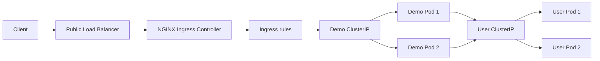
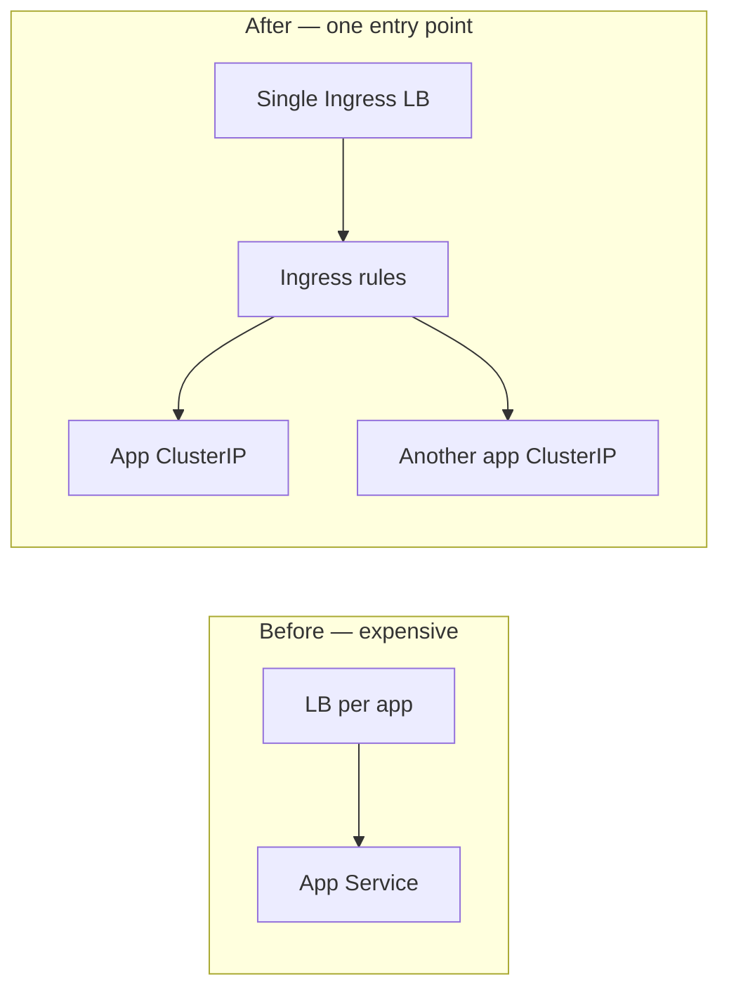
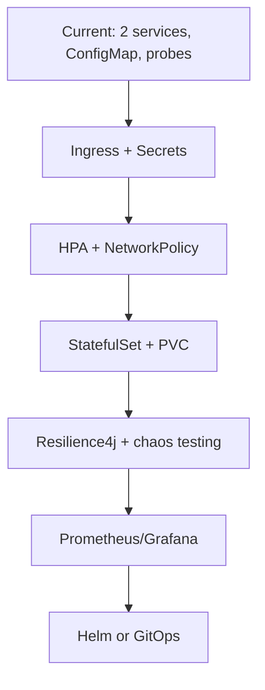

# Azure Kubernetes Service (AKS) — Spring Boot Demo

A minimal Java 21 + Spring Boot 3 application packaged for Docker and deployed to **Azure Kubernetes Service (AKS)**.

## What’s included

| Component | Purpose |
|-----------|---------|
| Spring Boot REST API | `/api/hello`, `/api/info`, `/api/demo/users` |
| Spring Actuator | Liveness/readiness probes for Kubernetes |
| Dockerfile | Multi-stage build (Maven + JRE) |
| `k8s/` manifests | Namespace, ConfigMap, Deployment (2 replicas), ClusterIP Service, Ingress |
| NGINX Ingress Controller | Cluster-wide LoadBalancer entry point (`ingress-nginx` namespace) |
| Scripts | Local/Azure deploy, ingress install, ACR push |

## Prerequisites

- Java 21, Maven 3.9+
- Docker
- [kubectl](https://kubernetes.io/docs/tasks/tools/)
- For Azure: [Azure CLI](https://learn.microsoft.com/cli/azure/install-azure-cli) (`az login`)

Local Kubernetes (optional): [minikube](https://minikube.sigs.k8s.io/) or [Docker Desktop Kubernetes](https://docs.docker.com/desktop/kubernetes/).

## Run locally (no Kubernetes)

Start the user service first (in `../Azure_User_Service`):

```bash
cd ../Azure_User_Service && mvn spring-boot:run
```

Then run this demo app:

```bash
mvn spring-boot:run
curl http://localhost:8080/api/hello
curl http://localhost:8080/api/demo/users
curl http://localhost:8080/actuator/health
```

## Run tests

```bash
mvn test
```

## Deploy to local Kubernetes

Deploy the user service first:

```bash
cd ../Azure_User_Service
chmod +x scripts/*.sh
./scripts/deploy-local.sh
```

Then deploy this demo app:

```bash
cd ../Azure_Kubernetes_Service
chmod +x scripts/*.sh
./scripts/deploy-local.sh
kubectl get ingress -n aks-demo
kubectl get svc -n ingress-nginx ingress-nginx-controller
# Easiest on Docker Desktop (LB IP often not reachable from Mac):
./scripts/curl-demo.sh /api/hello
./scripts/curl-demo.sh /api/demo/users

# Or manually via port-forward:
kubectl port-forward -n ingress-nginx svc/ingress-nginx-controller 8080:80
curl http://localhost:8080/api/hello

# On Azure AKS, the ingress IP is a real public IP:
curl http://<INGRESS-IP>/api/hello
```

## Deploy to Azure (AKS)

Shared Azure settings (same cluster for both services):

| Setting | Value |
|---------|-------|
| Resource group | `aks-demo-rg` |
| AKS cluster | `aks-demo-cluster` |
| ACR | `aksdemodemo776b77.azurecr.io` |
| Demo namespace | `aks-demo` |
| User namespace | `user-demo` |
| Internal user URL | `http://azure-user-service.user-demo.svc.cluster.local` |

### 1. Create Azure resources (first time only)

```bash
chmod +x scripts/*.sh
./scripts/azure-setup.sh
```

Defaults: **1 node**, **`Standard_D2s_v3`** (2 vCPUs) — fits typical free-account regional quota (~4 vCPUs in `eastus`).

If you hit `InsufficientVCPUQuota`, avoid large SKUs (e.g. `standard_dc16ads_cc_v5` = 16 vCPUs). Override:

```bash
NODE_COUNT=1 NODE_VM_SIZE=Standard_D2s_v3 ./scripts/azure-setup.sh
```

Check quota: `az vm list-usage --location eastus -o table`

### 2. Deploy User Service on the same AKS cluster

```bash
cd ../Azure_User_Service
chmod +x scripts/*.sh

# Build and push (linux/amd64) — uses ACR aksdemodemo776b77 by default
./scripts/push-to-acr.sh aksdemodemo776b77 1.0.0

# Deploy to shared cluster
./scripts/deploy-azure.sh
kubectl get pods -n user-demo
```

### 3. Build and push the demo app image

```bash
cd ../Azure_Kubernetes_Service
./scripts/push-to-acr.sh aksdemodemo776b77 1.0.1
```

ACR and image tag are already set in `k8s/overlays/azure/kustomization.yaml`.

### 4. Deploy demo app to AKS

```bash
./scripts/deploy-azure.sh
kubectl get pods -n aks-demo
kubectl get ingress -n aks-demo
kubectl get svc -n ingress-nginx ingress-nginx-controller
```

The deploy script installs **NGINX Ingress Controller** (LoadBalancer) and routes traffic to the demo app (ClusterIP). Test via the ingress IP:

```bash
./scripts/ingress-address.sh
curl http://<INGRESS-IP>/api/hello
curl http://<INGRESS-IP>/api/info
curl http://<INGRESS-IP>/api/demo/users
```

Install ingress only (without redeploying the app):

```bash
./scripts/install-ingress-nginx.sh
```

## Architecture



Traffic flow: **Client → Ingress LoadBalancer → NGINX → Ingress rules → `aks-spring-demo` ClusterIP → pods**. The user service stays internal (ClusterIP only).

Interactive diagram: [azure-services-architecture](/Users/dhaval/.cursor/projects/Users-dhaval-PlayGround-Azure-Services/canvases/azure-services-architecture.canvas.tsx) (open beside chat in Cursor).

## Learn: Ingress, routing, TLS, cost control

This project implements the **Week 1** learning goal: one public entry point, path/host routing, TLS secrets, and NGINX annotations.

### Cost control — one LoadBalancer

| Before (per-app LoadBalancer) | After (Ingress) |
|-------------------------------|-----------------|
| Demo Service `type: LoadBalancer` → **$15–20+/mo each** | Demo Service `type: ClusterIP` → **no public IP** |
| Add more apps → more LoadBalancers | **One** `ingress-nginx-controller` LoadBalancer serves many Ingress rules |



**In this repo:** only `ingress-nginx-controller` (namespace `ingress-nginx`) has `type: LoadBalancer`. The demo app and user service are ClusterIP.

### IngressClass — which controller handles traffic?

An **Ingress** resource is just routing rules. An **IngressClass** tells Kubernetes which controller implementation should reconcile it.

```bash
kubectl get ingressclass
# NAME    CONTROLLER             PARAMETERS   AGE
# nginx   k8s.io/ingress-nginx   <none>       ...
```

Our Ingress sets `spec.ingressClassName: nginx`, which binds it to the NGINX Ingress Controller installed by `scripts/install-ingress-nginx.sh`.

| Concept | Role |
|---------|------|
| **Ingress** | HTTP routing rules (paths, hosts, TLS) |
| **IngressClass** | Links Ingress → controller (nginx, traefik, etc.) |
| **Ingress Controller** | Pod(s) that read Ingress objects and configure the proxy (NGINX) |

### Path-based routing

Defined in `k8s/base/ingress.yaml`:

| Path prefix | Routes to | Example |
|-------------|-----------|---------|
| `/api` | `aks-spring-demo:80` | `/api/hello`, `/api/demo/users` |
| `/actuator` | `aks-spring-demo:80` | `/actuator/health` |

```yaml
spec:
  rules:
    - http:
        paths:
          - path: /api
            pathType: Prefix
            backend:
              service:
                name: aks-spring-demo
                port:
                  number: 80
```

**Try it:**
```bash
./scripts/curl-demo.sh /api/hello           # auto-detects best access method
curl http://<INGRESS-IP>/api/hello          # Azure AKS (public IP)
curl http://localhost:8080/api/hello        # Docker Desktop (with port-forward)
```

> **Docker Desktop note:** `kubectl get svc` may show `EXTERNAL-IP: 172.18.0.x` but that IP is **inside Docker's network** and is usually **not reachable** from your Mac. Use `./scripts/curl-demo.sh` or port-forward instead.

With multiple apps, each path prefix would point to a different `Service` — same Ingress, same LoadBalancer.

### Host-based routing (local overlay)

`k8s/overlays/local/ingress-patch.yaml` adds a **host rule** so traffic must use `Host: demo.local`:

```yaml
spec:
  rules:
    - host: demo.local
      http:
        paths: ...
```

**Setup:**
```bash
echo '127.0.0.1 demo.local' | sudo tee -a /etc/hosts
kubectl port-forward -n ingress-nginx svc/ingress-nginx-controller 8080:80 8443:443
curl -H 'Host: demo.local' http://localhost:8080/api/hello
```

### Annotations — NGINX-specific behavior

Annotations on the Ingress metadata configure the controller without changing the portable `spec`:

| Annotation | Purpose in this project |
|------------|-------------------------|
| `nginx.ingress.kubernetes.io/proxy-body-size` | Max upload size (`1m`) |
| `nginx.ingress.kubernetes.io/ssl-redirect` | `false` on Azure/base; `true` on local TLS overlay |
| `nginx.ingress.kubernetes.io/force-ssl-redirect` | Redirect HTTP → HTTPS when TLS enabled |
| `cert-manager.io/cluster-issuer` | (Azure example) Auto-issue Let's Encrypt certs |

Inspect live annotations:
```bash
kubectl get ingress aks-spring-demo -n aks-demo -o yaml | grep -A20 annotations
```

### TLS secrets

TLS certificates are stored in a Kubernetes **Secret** (`type: kubernetes.io/tls`), referenced by the Ingress:

```yaml
spec:
  tls:
    - hosts:
        - demo.local
      secretName: aks-spring-demo-tls   # Secret name
  rules:
    - host: demo.local
      ...
```

**Local — self-signed cert (learning):**
```bash
./scripts/generate-tls-secret.sh              # creates Secret aks-spring-demo-tls
kubectl get secret aks-spring-demo-tls -n aks-demo
./scripts/deploy-local.sh                   # TLS enabled by default (ENABLE_INGRESS_TLS=true)
```

`deploy-local.sh` auto-generates the Secret. Test HTTPS:
```bash
kubectl port-forward -n ingress-nginx svc/ingress-nginx-controller 8443:443
curl -k https://demo.local:8443/api/hello
```

**Azure — production TLS (optional):**

See `k8s/overlays/azure/ingress-tls.example.yaml` for cert-manager + Let's Encrypt with a real domain. Requires:

1. DNS A-record → ingress LoadBalancer IP
2. [cert-manager](https://cert-manager.io/) installed on the cluster
3. `ClusterIssuer` for Let's Encrypt
4. Ingress patch with `cert-manager.io/cluster-issuer` annotation

cert-manager creates/renews the TLS Secret automatically — you never commit private keys to Git.

### Commands cheat sheet

```bash
# Controller (the one LoadBalancer)
kubectl get svc -n ingress-nginx ingress-nginx-controller
./scripts/ingress-address.sh

# Routing rules
kubectl get ingress -n aks-demo
kubectl describe ingress aks-spring-demo -n aks-demo

# IngressClass
kubectl get ingressclass

# TLS Secret
kubectl get secret aks-spring-demo-tls -n aks-demo

# Debug routing
kubectl logs -n ingress-nginx -l app.kubernetes.io/component=controller --tail=50
```

### What to explore next

| Exercise | Skill |
|----------|-------|
| Add a second path rule to a different Service | Multi-service routing |
| Enable `ingress-tls.example.yaml` on Azure with your domain | Production TLS |
| Add `nginx.ingress.kubernetes.io/limit-rps` annotation | Rate limiting at ingress |
| Compare `kubectl get svc` before/after Ingress migration | Cost / architecture |

## API endpoints

| Method | Path | Description |
|--------|------|-------------|
| GET | `/api/hello` | Greeting + pod hostname + timestamp |
| GET | `/api/info` | App metadata |
| GET | `/api/demo/users` | Fetches hardcoded users from `Azure_User_Service` |
| GET | `/actuator/health` | Health (used by probes) |

## Configuration

- `APP_MESSAGE` — greeting text (from ConfigMap in cluster)
- `USER_SERVICE_URL` — base URL for `Azure_User_Service` (default `http://localhost:8081` locally; in cluster `http://azure-user-service.user-demo.svc.cluster.local`)
- `application.yml` — server port, actuator probe settings

## Clean up Azure resources

```bash
az group delete --name aks-demo-rg --yes --no-wait
```

Adjust the resource group name if you changed `RESOURCE_GROUP` in `azure-setup.sh`.

## Suggested learning roadmap

This demo already covers a solid foundation: **2 services, 2 namespaces, ConfigMap, probes, Kustomize overlays, local vs Azure**. Use the enhancements below to add features and learn more Kubernetes concepts progressively.

### Learning path



### Weekly plan

| Week | Enhancement | Kubernetes skill gained |
|------|-------------|-------------------------|
| 1 | Ingress + Secrets | Routing, secret management |
| 2 | HPA + load test | Autoscaling |
| 3 | NetworkPolicy | Internal security |
| 4 | PVC + StatefulSet | Persistence |
| 5 | Resilience4j + fault injection | Reliability patterns |
| 6 | Prometheus + Grafana | Observability |
| 7 | Helm or Argo CD | Packaging / GitOps |

### Tier 1 — Quick wins (1–2 hours each)

| Enhancement | What to build | Kubernetes concepts |
|-------------|---------------|---------------------|
| **Ingress** | ✅ NGINX Ingress, path/host routing, local TLS Secret (see **Learn: Ingress**) | Ingress, IngressClass, TLS secrets |
| **Secrets** | API key header on user service calls | `Secret`, `envFrom`, volume mounts |
| **HPA** | Scale demo app 1→5 on CPU | HorizontalPodAutoscaler, metrics-server |
| **Probe simulation** | `/api/admin/fail-readiness`, `/api/admin/fail-liveness` | Liveness vs readiness, pod lifecycle |

### Tier 2 — Medium (half day each)

| Enhancement | What to build | Kubernetes concepts |
|-------------|---------------|---------------------|
| **Persistent store** | User service backed by PVC or database | StatefulSet, PVC, StorageClass |
| **Config hot-reload** | Feature flags from ConfigMap volume | ConfigMap mounts, rollout restart |
| **NetworkPolicy** | Only `aks-demo` → `user-demo` on port 80 | NetworkPolicy, namespace selectors |
| **CronJob** | Nightly fake user-sync job | Job, CronJob, completions |

### Tier 3 — Advanced (1–2 days each)

| Enhancement | What to build | Kubernetes concepts |
|-------------|---------------|---------------------|
| **Resilience4j** | Retry, timeout, circuit breaker on `/api/demo/users` | Fault injection, dependency health |
| **Helm charts** | Package `k8s/` as Helm releases | Values per env, release management |
| **GitOps** | Argo CD or Flux auto-sync from Git | Declarative deploys, drift detection |
| **Observability** | Actuator + Prometheus + Grafana dashboard | Metrics, logs, traces |
| **Blue/green or canary** | Run `1.0.1` and `1.0.2` side by side | Rollout strategies, traffic splitting |
| **Init containers** | Demo waits for user service before starting | Init containers, sidecars |

### Top 5 recommended next steps

1. **Azure TLS with cert-manager** — enable `ingress-tls.example.yaml` with a real domain
2. **NetworkPolicy** — secure the `user-demo` namespace
3. **HPA + load test** — watch pods scale under load
4. **Resilience4j on `/api/demo/users`** — realistic microservice failure handling
5. **Prometheus metrics from Actuator** — connect Spring Boot to cluster monitoring

### Spring Boot features paired with Kubernetes

| App feature | Kubernetes feature it teaches |
|-------------|-------------------------------|
| `POST /api/users` (add user) | PVC / database + StatefulSet |
| `GET /api/users/{id}` | Service discovery + retries |
| API key header validation | Secrets |
| `/api/version` returning image tag | Downward API (`metadata.labels`) |
| Graceful shutdown endpoint | `preStop` hook, `terminationGracePeriodSeconds` |

Example Downward API env vars to expose pod identity in `/api/hello`:

```yaml
env:
  - name: POD_NAME
    valueFrom:
      fieldRef:
        fieldPath: metadata.name
  - name: POD_NAMESPACE
    valueFrom:
      fieldRef:
        fieldPath: metadata.namespace
```

## Project structure

```
├── pom.xml
├── Dockerfile
├── src/main/java/com/demo/aks/
├── k8s/
│   ├── base/
│   │   ├── deployment.yaml
│   │   ├── service.yaml
│   │   └── ...
│   └── overlays/
│       ├── local/    # Docker Desktop / minikube
│       └── azure/
└── scripts/
    ├── deploy-local.sh
    ├── deploy-azure.sh
    ├── install-ingress-nginx.sh
    ├── ingress-address.sh
    ├── generate-tls-secret.sh
    ├── azure-setup.sh
    └── push-to-acr.sh
```
